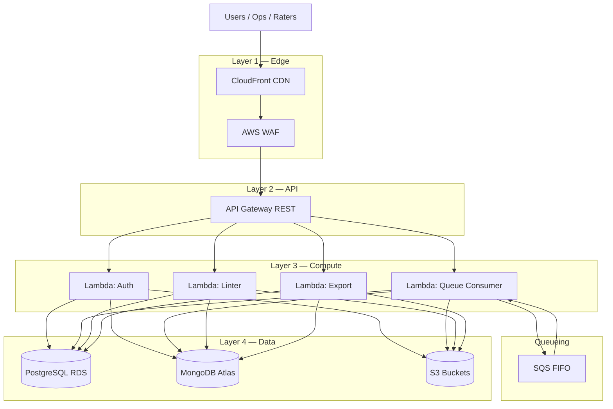
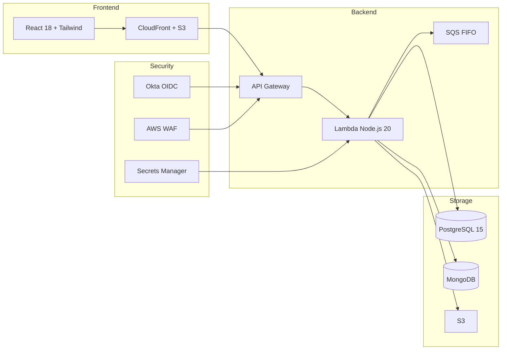
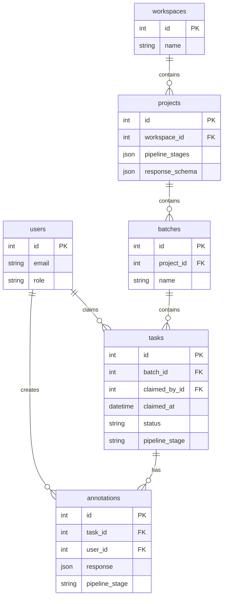
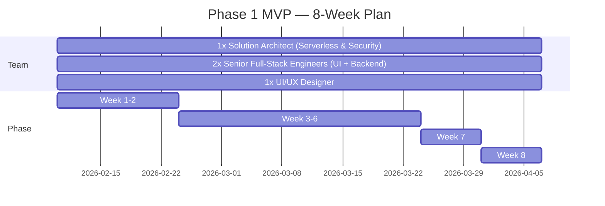

# Data Annotation Smart Factory Proposal — Mermaid Diagrams

These diagrams correspond to the **Data_Annotation_Smart_Factory_Proposal_Final.pptx** (technical architecture, infra, database, workflow). Use in docs or render in GitHub / Mermaid Live.

---

## 1. High-Level Architecture (Slide 7 — Architecture Blueprint)



---

## 2. Technology Stack — Component Map (Slide 6)



---

## 3. End-to-End Workflow (Slides 5, 11 — Smart Factory + How It Works)

```mermaid
flowchart LR
    subgraph Ingest["1. INGEST"]
        A[Ops uploads batch]
        B[Validate files]
        C[Push to SQS Pending]
    end

    subgraph Assign["2. ASSIGNMENT"]
        D[Rater clicks Start]
        E[Pop from Queue]
        F[PostgreSQL: SELECT FOR UPDATE SKIP LOCKED]
        G[Lock task to User A]
    end

    subgraph Execute["3. EXECUTION"]
        H[Rater labels]
        I[Auto-save]
        J[Submit → Linter Lambda]
        K{Valid?}
    end

    subgraph Delivery["4. DELIVERY"]
        L[Move to Done/Review]
        M[Export JSON/CSV]
        N[Signed S3 URLs]
    end

    A --> B --> C
    C --> D --> E --> F --> G
    G --> H --> I --> J --> K
    K -->|Yes| L --> M --> N
    K -->|No| H
```



---

## 4. Task Claim — Sequence (Deterministic Locking)

```mermaid
sequenceDiagram
    participant Rater
    participant API
    participant Lambda
    participant PostgreSQL
    participant SQS

    Rater->>API: POST /queue/next
    API->>Lambda: Invoke (or sync DB)
    Lambda->>PostgreSQL: BEGIN; SELECT id FROM tasks WHERE batch_id=? AND claimed_by_id IS NULL ORDER BY created_at LIMIT 1 FOR UPDATE SKIP LOCKED
    PostgreSQL-->>Lambda: task_id
    Lambda->>PostgreSQL: UPDATE tasks SET claimed_by_id=?, claimed_at=NOW() WHERE id=?
    Lambda->>PostgreSQL: COMMIT
    Lambda-->>API: task payload
    API-->>Rater: 200 + task
```

---

## 5. Database & Data Model (Slide 8 — Conceptual ER)



---

## 6. 8-Week Timeline (Slide 13 — Team & Timeline)



---

## 7. Security & Access Flow (Internal vs External)

```mermaid
flowchart TB
    subgraph External["External (Raters)"]
        R[Rater Workbench]
    end

    subgraph Internal["Internal (Ops / Managers)"]
        O[Ops Command Center]
    end

    subgraph Okta["Okta"]
        IDP[Identity Provider]
    end

    subgraph API_Gateway["API Gateway"]
        ExtPath[/queue, /tasks/claim, /submit]
        IntPath[/workspaces, /projects, /batches, /export]
    end

    R --> ExtPath
    O --> IntPath
    R & O --> IDP
    IDP --> ExtPath & IntPath
    ExtPath --> Lambda
    IntPath --> Lambda
```

---

## How to Use

- **GitHub**: Paste any code block into a `.md` file; GitHub renders Mermaid automatically.
- **Mermaid Live**: https://mermaid.live — paste and export as PNG/SVG.
- **VS Code**: Install "Mermaid Preview" or "Markdown Preview Mermaid Support" to preview.

All diagrams align with the final proposal deck: architecture layers, tech stack, workflow, DB model, timeline, and security.
